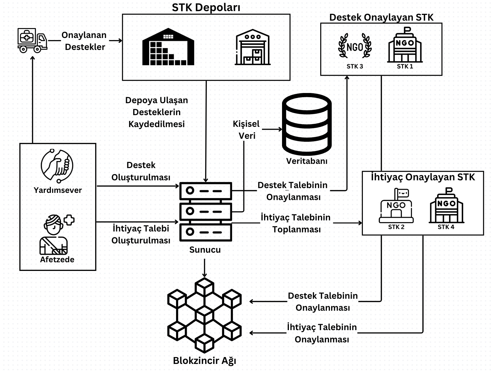
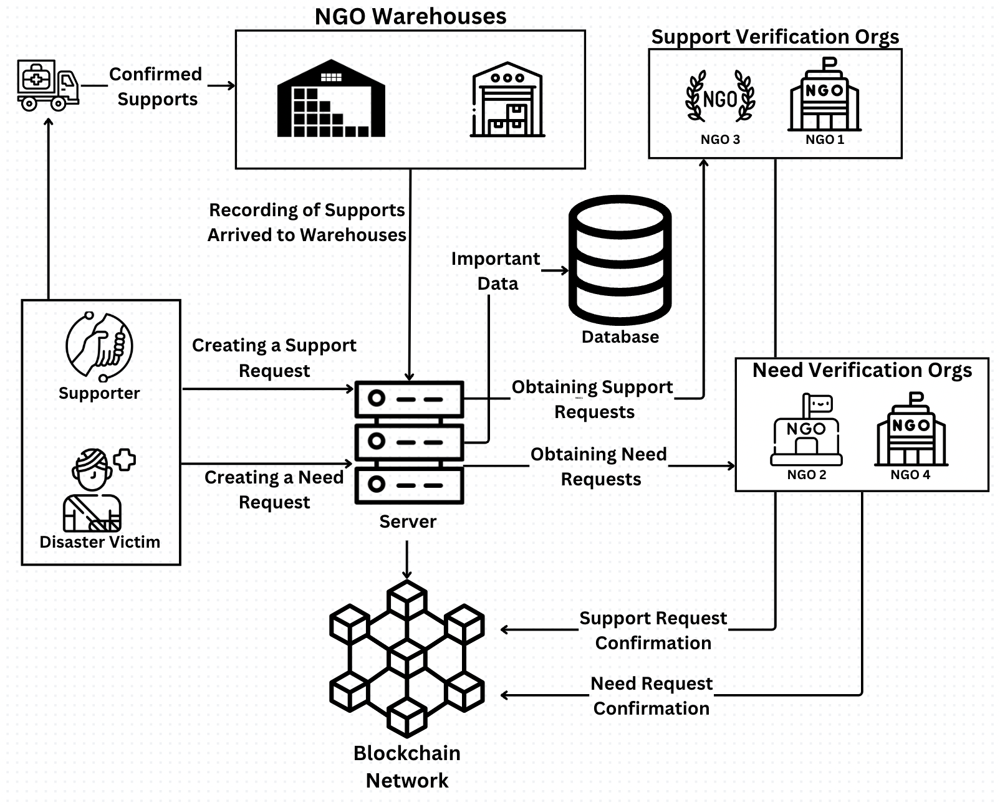

[DepoZinciri (ENG)](#depozinciri-eng) English version available

# DepoZinciri

DepoZinciri blokzincir tabanlı bir afet ve depo yönetim sistemidir.

## İçindekiler

- [Giriş](#giriş)
- [Sistem Diagramı](#sistem-diagramı)
- [Gereklilikler](#gereklilikler)
- [Kurulum](#kurulum)
- [Kullanım](#kullanım)
- [Proje Yapısı](#proje-yapısı)

## Giriş

DepoZinciri, acil durumlarda (doğal afet vb.) sivil toplum kuruluşlarına yardımcı olmayı hedefleyen bir uygulamadır. Afetzedeler mümkün olan en kısa sürede sistemi kullanarak ihtiyaçlarını STK yetkililerine iletir. STK yetkilileri ise, DepoZinciri sayesinde acil durum ihtiyaçları onaylanması ve karşılamasını yapar. Aynı zamanda, STK'lara ait olan depoların yönetimini de sağlar. Bu sayede aktif bir şekilde afet yönetimine yardımcı olmaktadır. Yapılan her bir işlem, tüm herkese açık bir şekilde, kişisel verilerin korunmasını sağlayak BlokZincirine işlenir. Bu sayede her bir yardım talebi ve gönderilen destek halka açık bir şekilde işlem görür. Sistem, her bir ihtiyacın ve gönderilen desteklerin izlenmesini Solidity sözleşmesi ile yapar. React ve Express.js kullandığımız bu projede, DS4H isimli blok zincir ağına entegre edilecektir. Yerel blok zinciri geliştirme için ise  Truffle ve Ganache kullanılır ve işlemleri yönetmek için MetaMask kullanılır.

## Sistem Diagramı



## Gereklilikler

- Node.js v16.14.2
- Ganache CLI
- MetaMask

## Kurulum

Projenin kurulumu için şu adımları izleyin:

1.  Repository Clone:
    ```bash
    git clone https://github.com/yourusername/DepoZinciri.git
    cd DepoZinciri
    ```

2. Tüm paketleri yükleyin
    ```bash
    npm run install:all
    ```

## Kullanım

Projeyi başlatmak için aşağıdaki komutları kullanın:

1. Projeyi başlatın
    ```bash
    npm start
    ```

2. Yerel Blokzinciri ağını kurun:
    ```bash
    ganache-cli -i 1337 --verbose
    truffle deploy
    make reset
    npm start
    ```

Gerekli ayarlamaları MetaMask üzerinden yapın

`http://localhost:8000` adresinden kullanabilirsiniz.

## Proje Yapısı

```plaintext
DepoZinciri/
├── build/
├── contracts/
├── expressjs/
│   ├── node_modules/
│   ├── public-ra/
│   │   ├── node_modules/
│   │   └── package.json
│   ├── package.json
│   └── ...
├── migrations/
├── node_modules/
├── test/
├── truffle-config.js
├── package.json
└── README.md
```

# DepoZinciri (ENG)

DepoZinciri is a blockchain-based disaster and warehouse management system.

## Contents

- [Introduction](#introduction)
- [Prerequisites](#prerequisites)
- [Installation](#installation)
- [Usage](#usage)
- [Project Structure](#project-structure)

## Introduction

DepoZinciri is an application that aims to help non-governmental organizations in emergency situations (natural disasters, etc.). Disaster victims communicate their needs to NGO officials using the system as soon as possible. NGO officials, on the other hand, approve and meet emergency needs thanks to DepoZinciri. It also provides management of warehouses belonging to NGOs. In this way, it actively helps disaster management. Each transaction made is processed publicly on the Blockchain, ensuring the protection of personal data. In this way, each request for help and support sent is processed publicly. The system monitors each need and the support sent through the Solidity contract. In this project, where we use React and Express.js, it will be integrated into the blockchain network called DS4H. Truffle and Ganache are used for local blockchain development, and MetaMask is used to manage transactions.

## System Diagram



## Prerequisites

- Node.js v16.14.2
- Ganache CLI
- MetaMask

## Installation

To set up the project, follow these steps:

1. Clone the repository:
    ```bash
    git clone https://github.com/yourusername/DepoZinciri.git
    cd DepoZinciri
    ```

2. Install all packages:
    ```bash
    npm run install:all
    ```

## Usage

To start the project, use the following commands:

1. Start the project:
    ```bash
    npm start
    ```

2. Set up the local blockchain network:
    ```bash
    ganache-cli -i 1337 --verbose
    truffle deploy
    make reset
    npm start
    ```

Make the necessary adjustments via MetaMask.

You can access the application at `http://localhost:8000`.

## Project Structure

```plaintext
DepoZinciri/
├── build/
├── contracts/
├── expressjs/
│   ├── node_modules/
│   ├── public-ra/
│   │   ├── node_modules/
│   │   └── package.json
│   ├── package.json
│   └── ...
├── migrations/
├── node_modules/
├── test/
├── truffle-config.js
├── package.json
└── README.md
